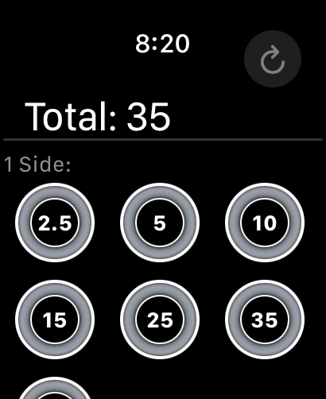
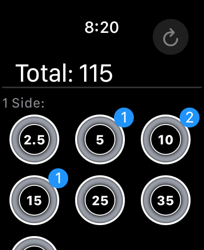

# BarMath – Barbell Weight Calculator for Apple Watch

**BarMath** makes calculating your barbell weight as easy as lifting it (well, almost)! Designed specifically for Apple Watch, it lets lifters skip the mental math and stay focused on their workout. Whether you're training for strength, powerlifting, or just trying to hit your PR, BarMath is the fast, intuitive tool you didn't know you needed.

## 🏋️‍♂️ Features

* **Instant Calculations**
  Add your bar weight, select plates, and see your total instantly.

* **Wrist-First Experience**
  Fully Apple Watch-native—no iPhone needed during your workout.

* **Clean, Minimal UI**
  Big, readable numbers. No clutter. Just the total weight you need.

## 📲 How It Works

1. **Set Your Bar Weight** – Choose your default bar (e.g., 45 lb, 35lb).
2. **Add Plates** – Tap a plate to add it. Tap multiple times to add multiples of the same plate.
3. **Automatic Doubling** – The app mirrors your selected plates for both sides of the bar.
4. **See Your Total** – Bar weight + plates = your total barbell weight.

> 🧠 No math required. Just tap and lift.

## 📦 Installation

Clone project and run on apple watch or watch simulator.

BarMath is available on the Apple Watch via the [App Store](https://apps.apple.com/us/app/barmath/id6737529139)

## 🧰 Tech Stack

* **SwiftUI**
* **WatchKit**
* **watchOS native app**

## 📸 Screenshots

| Default view | Set bar weight | Add plate weight |
|----------|----------|----------|
|   |  |  |

# 🛠️ App Architecture

This iOS Watch app is built using a custom Redux-style architecture tailored specifically for our needs. The goal was to adopt a predictable state management pattern without introducing third-party dependencies such as The Composable Architecture (TCA).

Key Concepts:
* Single Source of Truth: The app state is centralized and immutable, updated only through actions.

* Unidirectional Data Flow: Views dispatch actions; reducers handle state transitions; the updated state flows back to the views.

* Pure Reducers: Reducers are pure functions that describe how the state changes in response to actions.

* Side Effects Encapsulated: Effects (e.g., network calls, timers) are managed explicitly and separated from state logic.

Why Not Use TCA?
While TCA provides a powerful and battle-tested architecture, we opted to implement a lightweight, hand-rolled Redux system to:

* Maintain full control over the architecture.

* Minimize binary size and dependencies on the Watch.

* Keep the learning curve minimal for contributors familiar with Redux concepts.

* This approach strikes a balance between architectural clarity and simplicity, making it ideal for the constraints of watchOS development.

